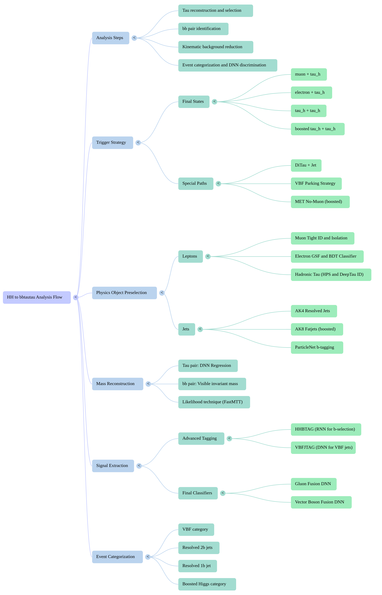

# HH → bbtautau Run3 Analysis

Contact: Konstantin Androsov <androsov@tamu.edu>, Teruki Kamon <kamon@tamu.edu>, Alexei Safonov <safonov@tamu.edu>, Maria Agnese Ciocci <mariaagnese.ciocci@pi.infn.it>, Giuseppe Bagliesi <giuseppe.bagliesi@cern.ch>, Towsifa Akhter <towsifa@tamu.edu>, Antimo Cagnotta <antimo.cagnotta@cern.ch>, Prabhat Solanki <prabhat.solanki@cern.ch>, Konstantin Androsov <konstantin.androsov@cern.ch>, Sayan Dhani <sayan.dhani@cern.ch>,.
Goal: Run3 Analysis of Resonant and Non-Resonant HH production in bbtautau Channel
Priority: P0
Status: Active
Supervisor & Grp: TAMU & INFN

---

### Key links

- **Git repo**: https://github.com/cms-flaf/HH_bbtautau
- **Main branch/tag**: https://github.com/cms-flaf/HH_bbtautau/tree/main
- **CMSSW / env**: https://github.com/cms-flaf/FLAF
- **EOS output dir**: https://cernbox.cern.ch/files/spaces/eos/user/s/sadhani/HH_bbtautau_Run3
- **Web plots**: https://sayan-dhani.web.cern.ch/, || https://towsifaakhter.web.cern.ch/HH_bbtautau/plots/v2512/
- **Indico / agendas**:https://indico.cern.ch/category/20090/
- **AN / Overleaf**:https://gitlab.cern.ch/tdr/notes/AN-25-103
- **Datasets/samples doc**:

---

### Analysis Flow

Broadly 4 steps

- **Reconstruction and selection of H → tautau Candidates**
    
    This focuses on identifying and reconstructing the decay products of a Higgs boson decaying into a tau pair (*H*→*ττ*) with optimal acceptance
    
    - **1. Triggering and Preselection**
        
        The search begins with an online trigger strategy using **Level-1 (L1)** and/or **High-Level Triggers (HLT)** to filter events containing electrons, muons, tau leptons, jets, or combinations of these.
        
        - https://github.com/cms-flaf/HH_bbtautau/blob/7a3dd9fbbf69d9767ca8ae47b433d30bfdc8f997/config/global.yaml#L184C1-L208C1
            
            ```yaml
            triggers:
              eTau: [ singleEle, etau ]
              muTau: [ singleMu, mutau ]
              tauTau: [ ditau, ditaujet ]
              eE: [ singleEle ]
              eMu: [ singleMu ]
              muMu: [ singleMu ]
            
            hist_triggers:
              eTau:
                default: ( HLT_singleEle && Legacy_region )  # ( ( (HLT_singleEle || HLT_etau ) && Legacy_region ) || (HLT_singleTau && SingleTau_region && !Legacy_region) || (HLT_MET && (!(Legacy_region) && !(SingleTau_region)) ))
                Run2_2016: ( ( (HLT_singleEle && SingleEle_region) || (HLT_singleTau && SingleTau_region && !Legacy_region) || (HLT_MET && (!(Legacy_region) && !(SingleTau_region)) )))
                Run2_2016_HIPM: ( ( (HLT_singleEle && SingleEle_region) || (HLT_singleTau && SingleTau_region && !Legacy_region) || (HLT_MET && (!(Legacy_region) && !(SingleTau_region)) )))
              muTau:
                default: (HLT_singleMu && Legacy_region)  # (( (HLT_singleMu || HLT_mutau ) && Legacy_region ) || (HLT_singleTau && SingleTau_region && !Legacy_region) || (HLT_MET && (!(Legacy_region) && !(SingleTau_region)) ))
              tauTau:
                # default: ( ( (HLT_ditau || HLT_ditaujet) && Legacy_Region ) ) # || (HLT_MET && !(Legacy_Region) ) )
                default: (HLT_ditau && Legacy_region)  # ((HLT_ditau && Legacy_region) || (HLT_singleTau && SingleTau_region && !Legacy_region) || (HLT_MET && (!(Legacy_region) && !(SingleTau_region)) ) )
              eE:
                default: (HLT_singleEle && SingleEle_region)
              eMu:
                default: (HLT_singleMu && SingleMu_region)  # ((HLT_singleEle && SingleEle_region) || (HLT_singleMu && SingleMu_region))
              muMu:
                default: (HLT_singleMu && SingleMu_region)
            ```
            
        - **Trigger Paths for resolved ττ channels ( $\tau_{\mu}\tau_{h}, \tau_{e}\tau_{h}, \tau_{h}\tau_{h}$):**
            - The analysis employs both single-lepton and "cross-object" triggers (e.g., $\tau_{h}\tau_{\mu}$ or $\tau_{h}\tau_{e}$ paths) to maximise sensitivity.
                - **τμτh:** OR of
                    - **single-μ** triggers (high efficiency for harder muons)
                        
                        ```yaml
                        [https://github.com/cms-flaf/HH_bbtautau/blob/7a3dd9fbbf69d9767ca8ae47b433d30bfdc8f997/config/Run3_2022/triggers.yaml#L102-L121](https://github.com/cms-flaf/HH_bbtautau/blob/7a3dd9fbbf69d9767ca8ae47b433d30bfdc8f997/config/Run3_2022/triggers.yaml#L102-L121)
                        
                        singleMu:
                          channels:
                            - muMu
                            - eMu
                            - mu
                          path:
                            - HLT_IsoMu24
                          legs:
                            - offline_obj:
                                cut: "{obj}_legType == Leg::mu && {obj}_pt > 26" # {obj}_pt > 26 && abs({obj}_eta) < 2.4
                              online_obj:
                                cut: TrigObj_id == 13 && (TrigObj_filterBits&8)!=0
                              doMatching: True
                              jsonTRGcorrection_key:
                                2022_Summer22: NUM_IsoMu24_DEN_CutBasedId{MuIDWP}_and_PFIso{MuIDWP}_{DataMC}eff
                                2022_Summer22EE: NUM_IsoMu24_DEN_CutBasedId{MuIDWP}_and_PFIso{MuIDWP}_{DataMC}eff
                                2023_Summer23: NUM_IsoMu24_DEN_CutBasedId{MuIDWP}_and_PFIso{MuIDWP}_{DataMC}eff
                                2023_Summer23BPix: NUM_IsoMu24_DEN_CutBasedId{MuIDWP}_and_PFIso{MuIDWP}_{DataMC}eff
                              jsonTRGcorrection_elepath: "placeholder"
                        ```
                        
                    - **μ+τh cross triggers** (recover efficiency when μ or τh is softer)
                        
                        ```yaml
                        https://github.com/cms-flaf/HH_bbtautau/blob/7a3dd9fbbf69d9767ca8ae47b433d30bfdc8f997/config/Run3_2022/triggers.yaml#L60C1-L79C47
                        
                        mutau:
                          channels:
                            - muTau
                          path:
                            - HLT_IsoMu20_eta2p1_LooseDeepTauPFTauHPS27_eta2p1_CrossL1
                          legs:
                            - offline_obj:
                                cut: "{obj}_legType == Leg::mu && {obj}_pt > 22 && abs({obj}_eta) < 2.1"
                              online_obj:
                                cut: TrigObj_id==13 && (TrigObj_filterBits&64)!=0  # && TrigObj_pt>20
                              doMatching: True
                              jsonTRGcorrection_key: { "2022_Summer22": "NUM_IsoMu20_DEN_CutBasedIdTight_and_PFIsoTight_{}eff", "2022_Summer22EE": "NUM_IsoMu20_DEN_CutBasedIdTight_and_PFIsoTight_{}eff" }
                              jsonTRGcorrection_elepath: "placeholder"
                            - offline_obj:
                                cut: "{obj}_legType == Leg::tau && {obj}_pt > 32 && abs({obj}_eta) < 2.1"
                              online_obj:
                                cut: TrigObj_id==15 && (TrigObj_filterBits&8)!=0 && (TrigObj_filterBits&8192)!=0
                              doMatching: True
                              jsonTRGcorrection_key: { "2022_Summer22": "tau_trigger", "2022_Summer22EE": "tau_trigger" }
                              jsonTRGcorrection_elepath: "placeholder"
                        ```
                        
                - **τeτh:** OR of
                    - **single-e** triggers
                        
                        ```yaml
                        singleEle:
                          channels:
                            - eMu
                            - eE
                            - e
                          path:
                            - HLT_Ele30_WPTight_Gsf
                          legs:
                            - offline_obj:
                                cut: "{obj}_legType == Leg::e && {obj}_pt > 32"  # {obj}_pt > 32 && abs({obj}_eta) < 2.4
                              online_obj:
                                cut: TrigObj_id==11 && (TrigObj_filterBits&2)!=0
                              doMatching: True
                              jsonTRGcorrection_key: { "2022_Summer22": "Electron-HLT-{}Eff", "2022_Summer22EE": "Electron-HLT-{}Eff" }
                              jsonTRGcorrection_elepath: "HLT_SF_Ele30_TightID"
                        
                        ```
                        
                    - **e+τh cross triggers**
                        
                        ```yaml
                        etau:
                          channels:
                            - eTau
                          path:
                            - HLT_Ele24_eta2p1_WPTight_Gsf_LooseDeepTauPFTauHPS30_eta2p1_CrossL1
                          legs:
                            - offline_obj:
                                cut: "{obj}_legType == Leg::e && {obj}_pt > 26 && abs({obj}_eta) < 2.1"
                              online_obj:
                                cut: TrigObj_id==11 && (TrigObj_filterBits&128)!=0  # && TrigObj_pt>24
                              doMatching: True
                              jsonTRGcorrection_key: { "2022_Summer22": "Electron-HLT-{}Eff", "2022_Summer22EE": "Electron-HLT-{}Eff" }
                              jsonTRGcorrection_elepath: "HLT_SF_Ele24_TightID"
                            - offline_obj:
                                cut: "{obj}_legType == Leg::tau && {obj}_pt > 35 && abs({obj}_eta) < 2.1"
                              online_obj:
                                cut: TrigObj_id==15 && (TrigObj_filterBits&8)!=0 && (TrigObj_filterBits&4096)!=0
                              doMatching: True
                              jsonTRGcorrection_key: { "2022_Summer22": "tau_trigger", "2022_Summer22EE": "tau_trigger" }
                              jsonTRGcorrection_elepath: "placeholder"
                        
                        ```
                        
            - A significant improvement in this analysis is the **DiTau+Jet trigger (key Run3 Inprovement)** for $\tau_{h}\tau_{h}$, which allows for lower lepton energy thresholds by requiring an additional central jet, resulting in an overall signal efficiency gain of approximately 13% (order 10%+ overall; larger at low mHH).
                
                ```yaml
                ditaujet:
                  channels:
                    - tauTau
                  path:
                    - HLT_DoubleMediumDeepTauPFTauHPS30_L2NN_eta2p1_PFJet60
                  legs:
                    - offline_obj:
                        cut: "{obj}_legType == Leg::tau && {obj}_pt > 35 && abs({obj}_eta) < 2.1"
                      online_obj:
                        cut: TrigObj_id==15 && (TrigObj_filterBits&8)!=0 && (TrigObj_filterBits&2048)!=0 && (TrigObj_filterBits&16384)!=0
                      doMatching: True
                      jsonTRGcorrection_key: { '2022_Summer22': 'tau_trigger', '2022_Summer22EE': 'tau_trigger' }
                      jsonTRGcorrection_elepath: "placeholder"
                    - offline_obj:
                        cut: "{obj}_legType == Leg::jet && {obj}_pt > 60"
                      online_obj:
                        cut: TrigObj_id==1 && (TrigObj_filterBits&131072)!=0
                      doMatching: True
                      jsonTRGcorrection_key: { '2022_Summer22': 'jetlegSFs', '2022_Summer22EE': 'jetlegSFs' }
                      jsonTRGcorrection_elepath: "placeholder"
                ```
                
        - T**riggers for boosted τhτh:** Two orthogonal trigger regions are used:
            - **METno-μ trigger** (PFMETNoMu + PFMHTNoMu) : powerful when ττ neutrinos produce large MET, common in boosted regime
            - **AK8 + ParticleNet ττ trigger** (boosted $\tau_{h}\tau_{h}$ inside a fat jet) : targets a **boosted ττ system inside an AK8 jet** using online ParticleNet ττ tagging
        - **VBF Parking:** For the Vector Boson Fusion (VBF) production mechanism, a "parking" strategy is used. This involves writing events directly to tape during the later stages of an LHC fill when the instantaneous luminosity is lower, which highly favours signal reconstruction efficiency for the characteristic forward VBF jets.
            - Including:
                - VBF inclusive (2 jets with high mjj and $\Delta\eta_{jj}$)
                - VBF + μ
                - VBF + e
                - VBF + $\tau_{h}$ / di-$\tau_{h}$, etc.
                - Code for VBF trigger
                    
                    ```yaml
                    vbf:  # to check kinematic cuts for offline objs and trigger bits for online objs
                      channels:
                        - tauTau
                      path:
                        - HLT_VBF_DoubleMediumDeepTauPFTauHPS20_eta2p1
                      legs:
                        - offline_obj:
                            cut: "{obj}_legType == Leg::tau && {obj}_pt > 20. && abs({obj}_eta) < 2.1"
                          online_obj:
                            cut: TrigObj_id==15 && (TrigObj_filterBits&8)!=0 && (TrigObj_filterBits&1024)!=0
                          dRMatching: 0.4
                          doMatching: True
                          jsonTRGcorrection_key: { '2022_Summer22': '', '2022_Summer22EE': '' }
                          jsonTRGcorrection_elepath: "placeholder"
                        - offline_obj:
                            cut: "{obj}_legType == Leg::jet && {obj}_pt > 40"
                          online_obj:
                            cut: TrigObj_id==1 && (TrigObj_filterBits&262144)!=0
                          doMatching: True
                          jsonTRGcorrection_key: { '2022_Summer22': 'jetlegSFs', '2022_Summer22EE': 'jetlegSFs' }
                          jsonTRGcorrection_elepath: "placeholder"
                    ```
                    
    - **2. Physics Object Identification — Offline physics-object preselection (build the object collections you trust)**
        
        Rigorous quality criteria and identification "Working Points" (WPs) are applied to the reconstructed objects to suppress backgrounds, such as jets misidentified as leptons. This step defines the **baseline object IDs and kinematic thresholds** that everything later depends on.
        
        - **Muons:**
            - **Action:** require tight muon ID, vertex compatibility, isolation, and trigger-compatible pT thresholds.
                - Tight WP; PV compatibility: **Δxy < 0.045 cm**, **Δz < 0.2 cm**
                - Relative isolation (PF-based) with ΔR<0.4, signal: **$I_{rel}$ < 0.15**; veto muons looser (0.3)
                - pT thresholds depend on which trigger fired (single-μ vs cross-$μτ_{h}$ vs VBF+Mu)
                - **Corrections:** muon ID/iso SFs from tag-and-probe (Z→μμ).
        - **Electrons:** Identification relies on a **multivariate BDT classifier** that combines track-matching, shower-shape, and isolation variables.
            - **Action:** tight electron ID (BDT-based), vertex compatibility, isolation, trigger-compatible pT.
                - Tight WP (~80% eff), isolation ΔR<0.3 with **$I_{rel} < 0.10$** (veto looser)
                - PV: **Δxy < 0.045 cm**, **Δz < 0.2 cm**
                - **Corrections:** electron reco/ID/iso SFs and energy scale/smearing (Z→ee-based).
        - **Hadronic Taus (tau, resolved):** Reconstructed via the **HPS (Hadrons-Plus-Strips) algorithm**, which targets specific decay modes. The **DeepTauV2P5** algorithm—a deep convolutional neural network—is used as a multi-classifier to reject jets, muons, and electrons.
            - **Action:** use HPS τh + DeepTau IDs with specific WPs.
                - DeepTau v2p5 (multi-output vsJet/vsMu/vsEle); chosen WPs include **medium vsJet**, **tight vsMu**, **very-very-loose vsEle**
                - PV: **Δz < 0.2 cm**
                - pT thresholds depend on trigger type:
                    - as low as **20 GeV** when the trigger didn’t include τ,
                    - higher for cross triggers (μτ/eτ) and di-τ triggers,
                    - special thresholds for VBF+τ and VBF+diτ triggers
                - **Corrections:** τ ID + energy scale SFs (including e→τ and μ→τ components).
        - **Boosted Taus:** For high-momentum Higgs bosons with collimated decay products, the analysis uses **boostedTau** identification. These are seeded from large-radius jets and evaluated using the **DeepBoostedTau** ID score against jets.
            - **Action:** select two opposite-sign boosted τ candidates with:
                - pT > 20 GeV, |η| ≤ 2.5
                - DeepBoostedTau vsJet score WP (year-dependent: **≥0.984 (2022)**, **≥0.990 (2023)**)
                - cleaning vs leptons and vs leading fat jet (explicit cleaning criteria in Table 21)
        - **MET and MET filters**
            - **Action:** MET itself isn’t cut hard at baseline, but **MET filters** are applied to remove pathological events (beam halo, bad PF muon, HCAL noise, etc.). (They also flag a “WIP” about ECAL bad calib filter usage for some eras.)
    - **3. Final State Assignment**
        
        Events are categorised into specific channels based on the types of leptons found offline.
        
        - **Channel definition (priority logic):** Using *offline* objectIs, if ≥1 muons are identified, the event is classified as **mu-tau**. If no muon is found but ≥1 electron is present, it is classified as **e-tau**. If only hadronic tau candidates are present, it is **tau-tau**.
        - **Boosted Category:** If the standard criteria are not met but two boosted tau candidates exist, the event is classified as **boosted tau-tau**.
        - **Orthogonality:** To ensure channels do not overlap, events with additional isolated electrons or muons are rejected via a **third-lepton veto.**
            - https://github.com/Sayan-Dhani/HH_bbtautau/blob/7a3dd9fbbf69d9767ca8ae47b433d30bfdc8f997/AnaProd/baseline.py#L174C1-L189C14
            
            ```python
            def ThirdLeptonVeto(df):
                df = df.Define(
                    "Electron_vetoSel",
                    f"""v_ops::pt(Electron_p4) > 10 && abs(v_ops::eta(Electron_p4)) < 2.5 && abs(Electron_dz) < 0.2 && abs(Electron_dxy) < 0.045
                                  && ( Electron_mvaIso_WP90 == true )
                                 && (HttCandidate.isLeg(Electron_idx, Leg::e)== false)""",
                )  # || ( Electron_mvaNoIso_WP90 && Electron_pfRelIso03_all<0.3) --> removed
                df = df.Filter("Electron_idx[Electron_vetoSel].size() == 0", "No extra electrons")
                df = df.Define(
                    "Muon_vetoSel",
                    f"""v_ops::pt(Muon_p4) > 10 && abs(v_ops::eta(Muon_p4)) < 2.4 && abs(Muon_dz) < 0.2 && abs(Muon_dxy) < 0.045
                                  && ( Muon_mediumId || Muon_tightId ) && Muon_pfRelIso04_all<0.3
                                  && (HttCandidate.isLeg(Muon_idx, Leg::mu) == false)""",
                )
                df = df.Filter("Muon_idx[Muon_vetoSel].size() == 0", "No extra muons")
                return df
            ```
            
    - **4. Best Pair Selection**
        
        Because multiple lepton combinations may exist in a single event, a dedicated sorting procedure resolves ambiguities.
        
        - **Sorting Logic:** Pairs are primarily sorted by the **isolation of the leading lepton**. If isolations are identical, the pair with the higher leading-lepton **transverse momentum (p_T)** is chosen.
        - **Subleading Criteria:** If ambiguities persist, the process is repeated for the trailing candidate’s isolation, then for its p_T. The first pair in this sorted list satisfying all baseline selections is retained.
    - **5. Reconstruct $m_{H{\tau\tau}}$ ( because neutrinos prevent direct reconstruction )**
        
        This step produces the key ττ-mass observable used later (and also improves downstream DNN performance).
        
        - **Signal channels: DNN regression of neutrinos**
            - For τμτh, τeτh, τhτh (and bτhτh treated like τhτh at inference), a **parameterised NN** regresses the **3-momenta of the two neutrinos** (6 outputs). It has:
                - a **regression head** (MSE loss) for neutrinos
                - a **classification head** (CE loss) to help the regression training by teaching the signal/background structure
            
            This produces a reconstructed m_Htt (“Regression” mass), and they show data/MC agreement plots. 
            
        - **Control channels (μμ / ee): FASTMTT likelihood**
            - In μμ/ee control channels, they use **FASTMTT**, a likelihood-based reconstruction that uses visible τ decay products and MET compatibility with a Higgs mass hypothesis.
- **Reconstruction and selection of *H*→*bb* and Check for VBF Jet Candidates**
    
    This step focuses on identifying the decay products of the second Higgs boson (H → bb) and assessing the presence of two additional jets originating from **Vector Boson Fusion (VBF)** production.
    
    - **Jet corrections (JER/JES logic)**
        
        Jets are corrected/smeared so MC matches data resolution (standard JER smearing procedure).
        
    - **1. Jet Selection: Resolved vs. Boosted Topologies**
        
        The analysis distinguishes between two experimental signatures based on the momentum of the Higgs boson:
        
        - **Resolved Topology (AK4 Jets):** In most cases, the two b quarks from the Higgs decay are well-separated and reconstructed as individual **AK4 jets** (radius parameter R=0.4). These jets must satisfy p_T > 20 GeV and |eta| < 4.7 (though b-tagging is limited to |eta| < 2.4).
        - **Boosted Topology (AK8 Jets):** When the Higgs boson has high transverse momentum (p_T ≥ 300 GeV), its decay products become collimated and merge into a single large-radius **AK8 jet** (R=0.8).
            - **Grooming:** To improve mass resolution, the **soft drop algorithm** is used to remove soft, wide-angle radiation and pileup.
            - **Mass Window:** The soft drop mass (m_{SD}) must fall within a Higgs window of **80–170 GeV**
    - **2. b-Jet Identification with ParticleNet**
        
        The analysis identifies jets originating from $b$ quarks using the **ParticleNet algorithm**, which assigns class probabilities based on jet constituents.
        
        - **AK4 Identification:** For standard jets, the **"BvAll" score** is used. A "Medium" working point, with a 1% light-flavour mistagging efficiency, is used to define resolved categories.
            - use **ParticleNet** with discriminant BvsAll=p(b)/(1−p(b))
            - **Medium WP** corresponds to ~1% light-jet mistag and is used to define resolved categories
            - final choice of the *two* AK4 b-jet candidates is done with a **custom HHBTag** selection (defined elsewhere in the note, but referenced as the method used here).
        - **AK8 Identification:** For boosted candidates, a specific **"bb-tag score"** identifies large-radius jets containing two $b$ quarks. Because standard Run 3 working points were not initially available, a custom threshold was optimised to balance signal efficiency and background rejection
            - use ParticleNet “bb-score” =p(bb)/[p(bb)+p(QCD)]
            - No official Run-3 WP at time → define a **custom threshold** optimised for boosted topologies,
            - Pick the **AK8 jet with the highest bb-score** as the H→bb candidate in the boosted category.
    - **3. HHBTAG Algorithm**
        
        To specifically select the jet pair most likely to originate from the H → bb decay in the resolved regime, the analysis uses a **Recursive Neural Network (RNN)** called **HHBTAG**.
        
        - **Architecture:** It utilizes **Long Short Term Memory (LSTM)** layers to model dependencies and build a "memory" of previous terms in the sequence.
        - **Inputs:** The network considers **13 variables**, including the ParticleNet score, jet kinematics (p_T, eta), energy/mass normalised to p_T\, and angular distances (Delta_phi, Delta_eta) between the jet and the H→tau-tau system.
        - **Selection:** Unlike other classifiers, HHBTAG does not use fixed working points; instead, the **two jets with the highest HHBTAG scores** in the event are automatically chosen as the Higgs decay products. This algorithm achieves a purity of **94% to 98%**, significantly outperforming standard tagging methods.
    - **4. b-tagging SF strategy (shape reweighting)**
        
        Instead of migrating events across pass/fail bins, they apply an **event weight** that reshapes the ParticleNet discriminant distribution:
        
        $$
        SF_{b\text{-tag}}=\prod_{i=1}^{N_{\text{jets}}} \omega(D_i,p_{T,i},\eta_i)
        $$
        
        with weights derived via tag-and-probe-like procedures in HF (tt dilepton) and LF (Z+jets) regions.
        
        Because reshaping can slightly change yields, they measure a **residual yield ratio r** in a no-btag control region and multiply it into the event weight.
        
    - **5. VBF Jet Tagging (VBFJTAG)**
        
        For events potentially produced via VBF, a dedicated algorithm called **VBFJTAG** identifies the two characteristic "VBF jets" among the remaining jets in the event.
        
        - **VBF Topology:** VBF jets typically appear in the **forward regions** of the detector with large pseudorapidity separation ( $\Delta\eta_{jj}$  > 3.0) and a high invariant mass ($M_{jj} > 500 GeV$).
        - **Algorithm Features:** VBFJTAG uses an architecture similar to HHBTAG but adds features like **jet isolation** (distance to the nearest jet) and **jet centrality** (how central the jet is relative to the VBF pair).
        - **Precedence:** In the final event categorisation, precedence is given to VBF candidates to account for the very small VBF production cross-section compared to gluon-gluon fusion (ggF).
- **Background Reduction and Mass Requirements**
    
    Step 3 of the analysis flow focuses on reducing background contributions by exploiting the kinematic properties of the signal, primarily through requirements on the invariant mass of the $\tau\tau$ and bb pairs. This stage is designed to improve the "signal-over-background" ratio before final signal extraction.
    
    - **Orthogonality and Lepton Vetoes**
        
        To ensure the four final states ($\tau_\mu\tau_h, \tau_e\tau_h, \tau_h\tau_h,\ and\ boosted\  \tau_h\tau_h$) are mutually exclusive, the analysis applies strict orthogonality requirements.
        
        - **Suppression of Drell-Yan:** Events containing additional isolated electrons or muons are rejected. This **"third-lepton veto"** is highly efficient for signal events because no additional leptons are expected in the $HH \to bb\tau\tau$ process.
        - **Veto Criteria:** Electrons used for this veto must have $p_T > 10$ GeV and satisfy a loose identification or isolation requirement ($I_e^{rel} < 0.3$). Similarly, veto muons must have $p_T > 10$ GeV and satisfy a loose isolation requirement ($I_\mu^{rel} < 0.3$).
        - **Charge and Separation:** To further ensure purity, the two reconstructed leptons in the signal pair must have **opposite electric charges** and be separated by an angular distance of $\Delta R > 0.5$ to prevent double-counting PF candidates.
    - **Elliptical Mass Selection**
        
        For the Gluon Fusion (ggF) categories, the analysis leverages the reconstructed masses of the two Higgs candidates ( $m_{H\tau\tau}$ and $m_{Hbb}$) by applying an elliptical selection.
        
        - **Application Scope:** This mass cut is optimised only for the **resolved topologies** (res1b and res2b), as these categories have the highest statistics. It is not applied to the boosted or VBF categories to avoid further limiting already low statistics in those regions.
        - **Optimisation Strategy:** The objective of the elliptical cut is not just to improve the signal-to-background ratio, but to remove background events that deviate significantly from the Higgs mass window, thereby **enhancing the performance of the subsequent Deep Neural Network (DNN)**.
        - **Signal Retention:** The selection is specifically tuned to retain **99% of the signal** while significantly reducing the background. For example, in the $\tau_h\tau_h$ channel, the cut retains 99% of the signal while removing 46% of the inclusive background.
        - **Formula and Shape:** The parameters of the ellipses are sampled separately for each channel to account for different reconstruction resolutions. The ellipses typically have a **larger extension in the $m_{Hbb}$ direction** because the background distribution spreads more extensively in the $m_{H\tau\tau}$ plane.
        - **Channel-Specific Formulas:** The analysis defines specific elliptical boundaries for each channel, such as the following for the $\tau_\mu\tau_h$ channel:
        $\frac{(m_{H\tau\tau} - 116 \text{ GeV})^2}{(61 \text{ GeV})^2} + \frac{(m_{Hbb} - 114 \text{ GeV})^2}{(228 \text{ GeV})^2} < 1$
        
        By applying these kinematic constraints, the analysis effectively cleans the data sample, ensuring that the remaining events are concentrated in the region where a Higgs pair signal is most likely to appear.
        
    
- **Categorization and Final Signal Extraction**
    
    Step 4 of the analysis flow is the final stage where events are systematically sorted into categories to maximise signal sensitivity, and high-level machine learning models are applied to separate the HH signal from dominant background processes.
    
    - **1. Event Categorisation Strategy**
        
        The categorisation is designed to handle the disparity between different production mechanisms and kinematic regimes.
        
        - **VBF Precedence:** Because the **Vector Boson Fusion (VBF)** production cross-section is roughly 18 times smaller than Gluon Fusion (ggF), precedence is given to VBF candidates. An event is classified as VBF if it satisfies specific criteria:
            - It contains two VBF-jet candidates identified by the VBFJTAG algorithm.
            - The di-jet system has an invariant mass $M_{jj} > 500 GeV$ and a pseudorapidity separation $\Delta\eta_{jj} > 3.0$.
            - It passes a selection threshold (typically 0.5) on the VBF DNN output node to minimise ggF contamination while maintaining at least 75% VBF signal acceptance.
        - **ggF Topologies:** Events that do not meet the VBF criteria are assigned to the **ggF class** and further sorted into three orthogonal categories based on the b-jet topology:
            - **Boosted:** Events containing an AK8 jet with $p_T > 300$ GeV and a soft-drop mass ($m_{SD}$) between 80 and 170 GeV that satisfies specific ParticleNet working points.
            - **res2b (Resolved 2b):** Events where the two AK4 jets with the highest HHBTAG scores both pass the "Medium" ParticleNet b-tagging working point.
            - **res1b (Resolved 1b):** Events where only one of the two leading HHBTAG jets passes the "Medium" working point.
        - **Channel Merging:** Due to the very low statistics in the boosted and VBF categories, the four individual $\tau\tau$ final states are merged into a single **"$X + \tau_h$"** category for these topologies.
    - **2. Deep Neural Networks for Signal Extraction**
        
        The analysis utilises two distinct Deep Neural Networks (DNNs) to differentiate the signal from backgrounds such as $t\bar{t}$ and Drell-Yan.
        
        ### **ggF DNN (Multi-classifier)**
        
        - **Purpose:** Trained to distinguish the $HH$ signal from $t\bar{t}$ and Drell-Yan (DY) backgrounds in the resolved and boosted ggF categories.
        - **Architecture:** It consists of 10 densely connected hidden layers (128 nodes wide) utilising **PreLu activation functions** and a 5% dropout rate to prevent overfitting.
        - **Input Features:** The network processes **categorical features** (lepton channel, $\tau_h$ decay modes, data-taking era) and **continuous features** (four-momenta of leptons, jets, and fatjets; MET; and tagging scores from DeepJet and HHBTAG). All kinematic variables are rotated relative to the lepton-pair system before processing.
        
        ### **VBF DNN**
        
        - **Architecture:** This dedicated classifier includes a **Lorentz Boost Network (LBN) head**, which is specifically designed to handle four-momentum coordinates of physics objects. It uses seven densely connected hidden layers with varying widths and **ELU activation functions**.
        - **Categorisation:** It is a multi-classifier with four output neurons: ggF-signal, VBF-signal, DY, and $t\bar{t}$.
        - **Input Variables:** It utilises low-level four-momentum coordinates (rotated in the transverse plane) and high-level variables such as **rapidity gaps** between jet candidates and **Fox-Wolfram moments** to capture complex event shapes.
    - **3. Binning Optimisation (Signal Flattening)**
        
        To ensure statistical robustness during the final limit-setting procedure, the DNN output histograms are optimised.
        
        - **Flattening Process:** An algorithm adjusts the bin boundaries so that the signal event yield is distributed **approximately flatly** across all bins .
        - **Benefits:** This technique reduces statistical fluctuations in bins that would otherwise have very low statistics, while simultaneously preserving the critical differences in shape between the signal and background distributions. This optimised binning is applied uniformly to all histograms used in the final analysis datacards to enhance fit robustness.
    

[HH_bbtautau Analysis Flow Descision Tree](Include/HH_bbtautau_Analysis_Flow_Decision_Tree.md)

```
┌──────────────────────────────────────────────────────────────────────────────┐
│                     HH → bbττ  (Run-3)  Analysis Flow                         │
│        Trigger → channel → ττ cand → bb cand → VBF check → cuts → DNN → fit    │
└──────────────────────────────────────────────────────────────────────────────┘

┌───────────────┐
│   START EVENT  │
└───────┬───────┘
        │
        v
┌──────────────────────────────────────────────────────────────────────────────┐
│ A) ONLINE SELECTION (L1+HLT OR)                                                │
│  - Resolved: single-μ/e OR (μ/e)+τh OR di-τh OR DiTau+Jet                      │
│  - Boosted τhτh: METno-μ OR (AK8 + ParticleNet ττ)                             │
│  - 2023 VBF parking: VBF-inclusive / VBF+μ / VBF+e / VBF+τ(h)/di-τ(h)          │
└───────────────┬──────────────────────────────────────────────────────────────┘
                │pass?
         ┌──────┴──────┐
         │             │
        no            yes
         │             │
         v             v
   [REJECT EVENT]  ┌───────────────────────────────────────────────────────────┐
                   │ B) OFFLINE OBJECT BUILDING                                 │
                   │  - e/μ/τh IDs + pT/η + PV + iso + cleaning                 │
                   │  - boosted τ (DeepBoostedTau)                              │
                   │  - jets (AK4/AK8) + JES/JER + grooming vars                │
                   │  - MET filters                                              │
                   └───────────────┬───────────────────────────────────────────┘
                                   │
                                   v
                   ┌───────────────────────────────────────────────────────────┐
                   │ C) CHANNEL ASSIGNMENT (priority + orthogonality)           │
                   │  if ≥1 μ  → τμτh                                            │
                   │  else if ≥1 e → τeτh                                        │
                   │  else if ≥2 τh → τhτh                                       │
                   │  else if ≥2 boosted τ → boosted τhτh                        │
                   │  else → reject                                              │
                   │  + third-lepton veto (orthogonality)                        │
                   └───────────────┬───────────────────────────────────────────┘
                                   │valid channel?
                            ┌──────┴──────┐
                            │             │
                           no            yes
                            │             │
                            v             v
                      [REJECT EVENT]  ┌────────────────────────────────────────┐
                                      │ D) ττ CANDIDATE SELECTION               │
                                      │  - build all ττ pairs for channel       │
                                      │  - require OS and ΔR>0.5                │
                                      │  - choose “best pair” via sorting:      │
                                      │      lead iso → lead pT → sublead iso → │
                                      │      sublead pT                         │
                                      └───────────────┬────────────────────────┘
                                                      │
                                                      v
                                      ┌────────────────────────────────────────┐
                                      │ E) RECONSTRUCT m_Hττ                    │
                                      │  - signal chans: NN ν-regression → m_Hττ│
                                      │  - control chans: FASTMTT               │
                                      └───────────────┬────────────────────────┘
                                                      │
                                                      v
┌──────────────────────────────────────────────────────────────────────────────┐
│ F) H→bb CANDIDATE                                                             │
│  if (AK8 H(bb) exists: pT>300, mSD in [80,170], bb-score pass) → BOOSTED bb    │
│     → pick AK8 with highest bb-score                                           │
│  else → RESOLVED bb                                                            │
│     → run HHBTag; pick two AK4 jets with highest HHBTag scores                 │
│  + apply b-tag SFs via ParticleNet shape reweighting (and residual r if used)  │
└───────────────┬──────────────────────────────────────────────────────────────┘
                │
                v
┌──────────────────────────────────────────────────────────────────────────────┐
│ G) VBF JET FINDING (VBFJTag)                                                   │
│  - choose dijet pair among remaining jets                                      │
│  - VBF-loose kinematics: mjj>500 GeV AND Δηjj>3.0                              │
└───────────────┬──────────────────────────────────────────────────────────────┘
                │VBF-loose?
         ┌──────┴─────────────────────────────────────────┐
         │                                                │
        no                                               yes
         │                                                │
         v                                                v
┌───────────────────────┐      ┌──────────────────────────────────────────────┐
│ I2) ggF-LIKE ROUTE     │      │ I1) VBF ROUTE (precedence)                   │
│  - define category:    │      │  - evaluate VBF DNN (multi-class)             │
│     if boosted bb →    │      │  - require VBF-node > 0.5 → Category = VBF    │
│        boosted         │      │    else → fall back to ggF-like               │
│     else resolved bb:  │      └──────────────────────────────────────────────┘
│        if (2 jets pass │
│           b-tag M WP)  │
│           → res2b      │
│        else if (1 pass)│
│           → res1b      │
└───────────────┬───────┘
                │
                v
┌──────────────────────────────────────────────────────────────────────────────┐
│ J) MASS-BASED CUTS                                                             │
│  if Category ∈ {res1b, res2b} → apply elliptical cut in (m_Hττ, m_Hbb)         │
│  else (boosted or VBF) → no ellipse                                            │
└───────────────┬──────────────────────────────────────────────────────────────┘
                │
                v
┌──────────────────────────────────────────────────────────────────────────────┐
│ K) FINAL DISCRIMINANT                                                          │
│  if Category = VBF → use VBF DNN output as fit variable                         │
│  else (res1b/res2b/boosted) → use ggF DNN output as fit variable               │
└───────────────┬──────────────────────────────────────────────────────────────┘
                │
                v
┌──────────────────────────────────────────────────────────────────────────────┐
│ L) HISTOGRAMS → DATACARDS                                                      │
│  - fill DNN output histograms per (Era × Channel × Category)                    │
│  - apply signal-flattening / bin optimization                                   │
│  - produce final templates (incl. systematics) for statistical fit              │
└──────────────────────────────────────────────────────────────────────────────┘

END

```

## Legend (one-line definitions for captions)

- **Resolved triggers:** single-lepton and lepton+τh / di-τh paths (plus DiTau+Jet for τhτh).
- **DiTau+Jet:** 2 τh + central jet trigger enabling lower τ thresholds → higher τhτh efficiency.
- **Boosted triggers:** orthogonal METno-μ and AK8+ParticleNet ττ selections.
- **Parking (VBF):** late-fill low-rate data-taking enabling dedicated VBF trigger paths.
- **Offline object building:** apply tight IDs, PV & isolation, cleaning; jets with JES/JER; MET filters.
- **Channel assignment:** mutually exclusive τμτh / τeτh / τhτh / boosted τhτh using priority logic.
- **Best pair:** choose one ττ candidate per event via isolation/pT ordering + OS & ΔR requirements.
- **m_Hττ reconstruction:** NN ν-regression (signal channels) or FASTMTT (control channels).
- **H→bb candidate:** boosted (AK8) if present; else resolved (AK4) via HHBTag best-pair selection.
- **VBFJTag:** selects VBF-like dijet pair; VBF-loose requires mjj and Δηjj thresholds.
- **VBF precedence:** classify VBF first; use VBF-DNN threshold to reduce ggF contamination.
- **Ellipse cut:** 2D (m_Hττ, m_Hbb) requirement applied only in resolved ggF categories (res1b/res2b).
- **Final discriminant:** DNN output histogram used as the observable in the statistical fit.
- **Signal flattening:** bin optimization to stabilize low-stat bins while preserving shape information.




### Requirement / Pre-Requisite :

[28] CMS Collaboration, "Identification of hadronic tau lepton decays using a deep neural network", Journal of Instrumentation 17 (7, 2022) P07023, doi:10.1088/1748-0221/17/07/p07023.

[29] M. Cacciari, G. P. Salam, and G. Soyez, "The anti-k_t jet clustering algorithm", Journal of High Energy Physics 2008 (4, 2008) doi:10.1088/1126-6708/2008/04/063.

[30] M. Cacciari, G. P. Salam, and G. Soyez, "FastJet user manual", The European Physical Journal C 72 (3, 2012) doi:10.1140/epjc/s10052-012-1896-2.

[31] C. Collaboration, "Jet energy scale and resolution performance with 13 TeV data collected by CMS in 2016–2018", CMS Detector Performance Summaries (2020).

[32] H. Qu and L. Gouskos, "Jet tagging via particle clouds", Physical Review D 101 (03, 2020) doi:10.1103/physrevd.101.056019.

[33] J. H. Friedman, "Greedy function approximation: A gradient boosting machine", The Annals of Statistics 29 (10, 2001) doi:10.1214/aos/1013203451.

[34] P. Speckmayer, A. Höcker, J. Stelzer, and H. Voss, "The toolkit for multivariate data analysis, TMVA 4", Journal of Physics: Conference Series 219 (4, 2010) 032057, doi:10.1088/1742-6596/219/3/032057.

[35] C. Collaboration, "Performance of the CMS muon trigger system in proton-proton collisions at √s = 13 TeV", Journal of Instrumentation 16 (7, 2021) P07001, doi:10.1088/1748-0221/16/07/p07001.

[36] A. J. Larkoski, S. Marzani, G. Soyez, and J. Thaler, "Soft drop", Journal of High Energy Physics 2014 (5, 2014) doi:10.1007/jhep05(2014)146.

[37] A. Kalinowski and W. Matyszkiewicz, "Efficient tau-pair invariant mass reconstruction with simplified matrix element techniques", 2025. [https://arxiv.org/abs/2509.26069](https://arxiv.org/abs/2509.26069).

[38] S. Hochreiter, "The vanishing gradient problem during learning recurrent neural nets and problem solutions", International Journal of Uncertainty, Fuzziness and Knowledge-Based Systems 06 (4, 1998) 107–116, doi:10.1142/s0218488598000094.

[39] S. Hochreiter and J. Schmidhuber, "Long short-term memory", Neural Computation 9 (11, 1997) 1735–1780, doi:10.1162/neco.1997.9.8.1735.

[40] F. Rosenblatt, "The perceptron: A probabilistic model for information storage and organization in the brain", Psychological Review 65 (1957), no. 6, 386–408.

[41] S. Linnainmaa, "The representation of the cumulative rounding error of an algorithm as a Taylor expansion of the local rounding errors", Master's thesis, Univ. Helsinki, 1970.

[42] P. J. Werbos, "Applications of advances in nonlinear sensitivity analysis", in Proceedings of the 10th IFIP Conference, 31.8–4.9, NYC, pp. 762–770. 1981.

[43] D. E. Rumelhart, G. E. Hinton, and R. J. Williams, "Learning representations by back-propagating errors", Nature 323 (October, 1986) 533–536, doi:10.1038/323533a0.

[44] G. Huang, Z. Liu, L. Van Der Maaten, and K. Q. Weinberger, "Densely connected convolutional networks", in 2017 IEEE Conference on Computer Vision and Pattern Recognition (CVPR), pp. 2261–2269. 2017. arXiv:1608.06993.

[45] H. Li et al., "Visualizing the loss landscape of neural nets", 2018. [https://arxiv.org/abs/1712.09913](https://arxiv.org/abs/1712.09913).

[46] K. He, X. Zhang, S. Ren, and J. Sun, "Deep residual learning for image recognition", 2015. [https://arxiv.org/abs/1512.03385](https://arxiv.org/abs/1512.03385).

[47] C. Guo and F. Berkhahn, "Entity embeddings of categorical variables", CoRR abs/1604.06737 (2016) arXiv:1604.06737.

[48] [fast.ai](http://fast.ai/), "Practical deep learning for coders, part 1 lesson 4", 2018. Accessed 2019/05/06. [course18.fast.ai/lessons/lesson4.html](http://course18.fast.ai/lessons/lesson4.html).

[49] S. Ioffe and C. Szegedy, "Batch normalization: Accelerating deep network training by reducing internal covariate shift", 2015. [https://arxiv.org/abs/1502.03167](https://arxiv.org/abs/1502.03167).

[50] N. Srivastava et al., "Dropout: A simple way to prevent neural networks from overfitting", Journal of Machine Learning Research 15 (2014) 1929–1958.

[51] K. He, X. Zhang, S. Ren, and J. Sun, "Delving deep into rectifiers: Surpassing human-level performance on imagenet classification", 2015. [https://arxiv.org/abs/1502.01852](https://arxiv.org/abs/1502.01852).

[52] I. Loshchilov and F. Hutter, "Decoupled weight decay regularization", 2019. [https://arxiv.org/abs/1711.05101](https://arxiv.org/abs/1711.05101).

[53] M. Erdmann, E. Geiser, Y. Rath, and M. Rieger, "Lorentz boost networks: Autonomous physics-inspired feature engineering", Journal of Instrumentation 14 (6, 2019) P06006–P06006, doi:10.1088/1748-0221/14/06/p06006.

[54] D.-A. Clevert, T. Unterthiner, and S. Hochreiter, "Fast and accurate deep network learning by exponential linear units (elus)", 2016. [https://arxiv.org/abs/1511.07289](https://arxiv.org/abs/1511.07289).

[55] C. Bernaciak, M. S. A. Buschmann, A. Butter, and T. Plehn, "Fox-Wolfram moments in Higgs physics", Physical Review D 87 (April, 2013) doi:10.1103/physrevd.87.073014.